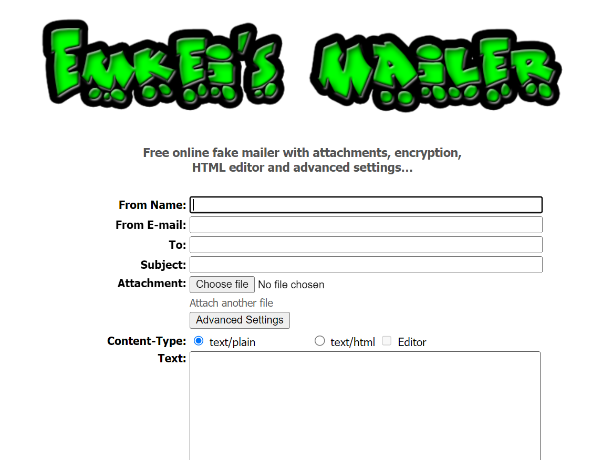
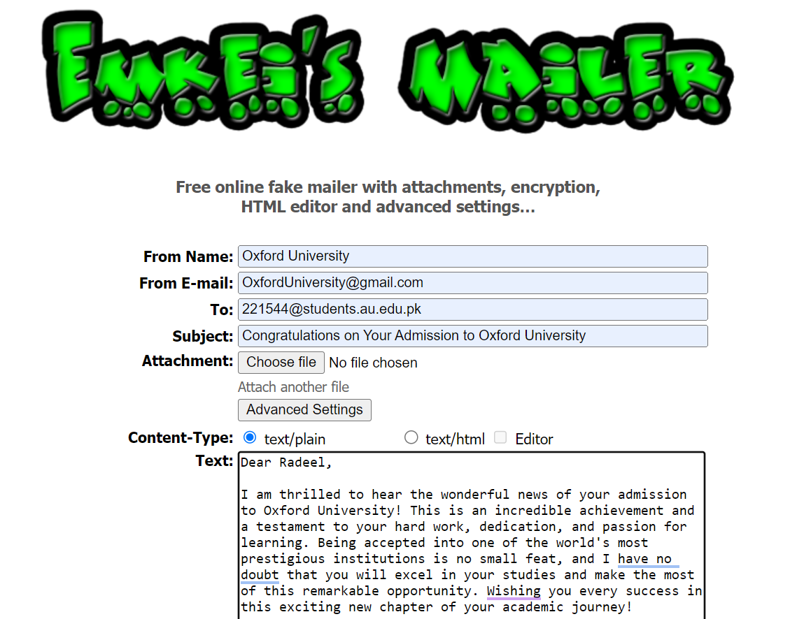
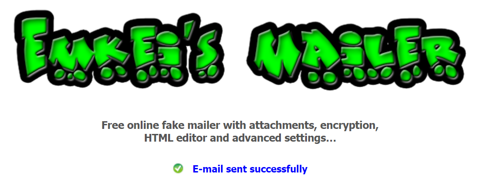

# Email-Spoofing

First, we open the `VPN` and then click on this [link](https://emkei.cz/)

    

Now fill the data according to your needs and press on send button

    

Now you see email send successfully

    

